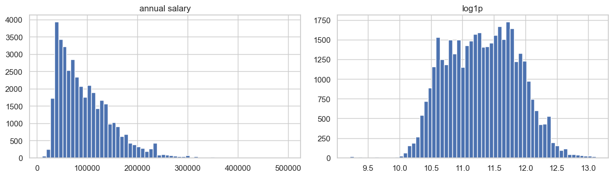
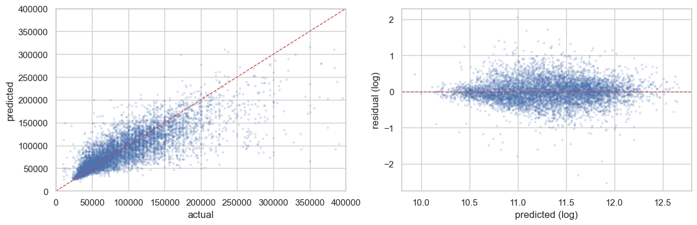
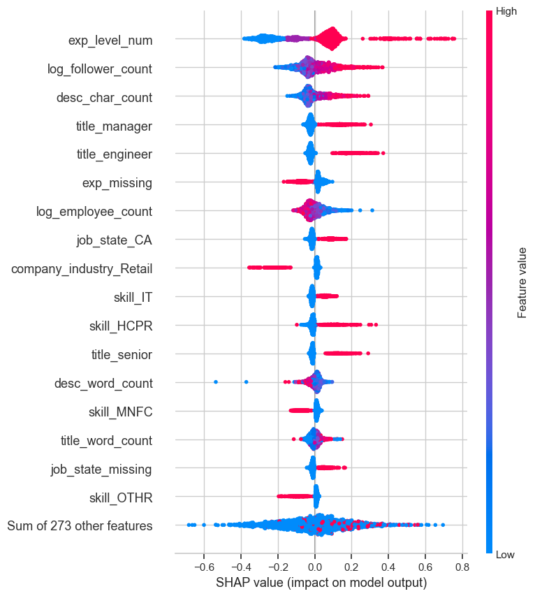
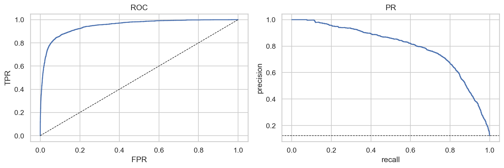
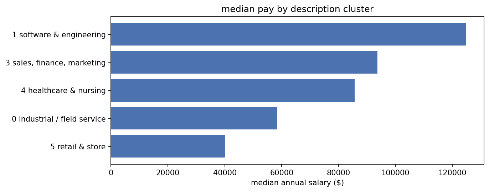
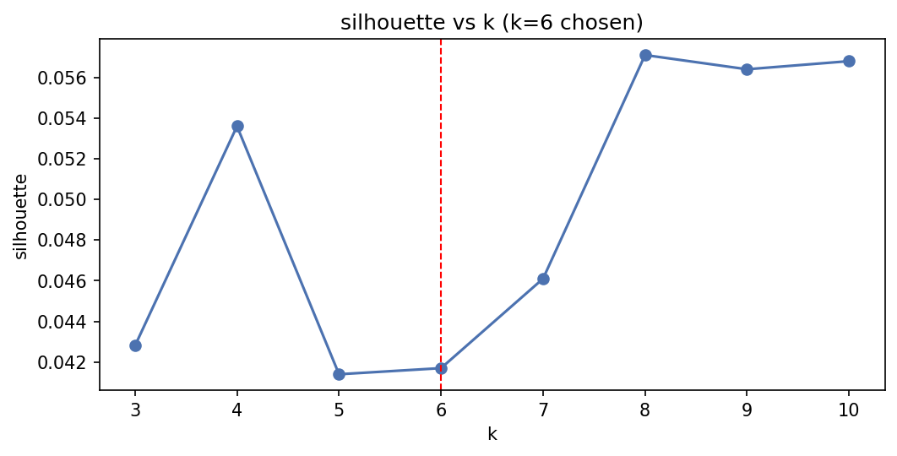

# LinkedIn Job Postings — salary, remote status, and description clusters

Three supervised and unsupervised tasks on the 2023–2024 LinkedIn job postings dataset: salary
regression (the main work), remote-vs-on-site classification, and clustering of job description
text. All three share one preprocessing base.

---

## Dataset

Source: [LinkedIn Job Postings (2023–2024)](https://www.kaggle.com/datasets/arshkon/linkedin-job-postings)
on Kaggle.

The data is normalised across eleven CSVs rather than one flat file. `postings.csv` is the spine,
keyed on `job_id`, and the rest hang off it:

```
postings.csv              123,849 rows, one per job_id  ── the spine
├── jobs/salaries.csv          one row per job_id, but only for ~1/3 of postings
├── jobs/job_skills.csv        long: 1.69 rows per job (a job has many skills)
├── jobs/job_industries.csv    long: 1.30 rows per job
├── jobs/benefits.csv          long: 2.26 rows per job
└── companies/                 joined via postings.company_id
    ├── companies.csv          one row per company
    ├── company_industries.csv
    ├── company_specialities.csv
    └── employee_counts.csv    a time series — 1.46 snapshots per company
```

The one-to-many tables are the thing to be careful about. Merging `job_skills` onto `postings`
naively turns 123,849 rows into roughly 210,000, silently duplicating every multi-skill job. Each
child table is aggregated to one row per key *before* any join, and the pipeline asserts the row
count is unchanged after every merge.

### Coverage

Salary is the bottleneck. Most postings do not disclose one:

```
123,849  postings
 36,073  with a disclosed salary (29.1%)
 35,546  after joining the target to the feature spine
 28,436  train / 7,110 test
```

Within the salary table, `min`/`max` and `med` are mutually exclusive — a row carries either a
range or a midpoint, never both. The target uses `med_salary` where present and the midpoint of
`min`/`max` otherwise, then annualises by pay period (hourly × 2080, monthly × 12, and so on).
Skipping the midpoint fallback is the single most expensive mistake available here; see Task 1.

### Getting the data

The dataset is not committed to this repository. Download it from the Kaggle link above, extract
it, and place the contents in `data/` so the structure matches the tree above.

---

## Task 1 — salary regression

Target is `log1p(annual_salary)`. Errors are reported in dollars by applying `expm1` to both the
prediction and the actual before subtracting.

### What the model is actually worth

| | |
|---|---|
| MAE | **$22,733** |
| RMSE | **$36,360** |
| Median annualised salary (n=40,228) | **$83,000** |
| Predictions within ±20% of actual | **54.5%** |

A typical prediction is off by about $22.7k on a median salary of $83k, and only just over half
land within ±20%. **Good enough to rank roles, not to quote a candidate a number.**

### Leaderboard

Five-fold CV on the training set, plus a held-out test split. R² is on the log target; MAE and
RMSE are dollars.

| model | CV R² | ± sd | test R² | MAE $ | RMSE $ |
|---|---|---|---|---|---|
| lightgbm tuned | 0.664 | 0.013 | 0.672 | 22,733 | 36,360 |
| stacking | 0.636 | 0.008 | 0.651 | 23,517 | 37,564 |
| lightgbm | 0.642 | 0.013 | 0.649 | 23,918 | 37,526 |
| random forest | 0.633 | 0.014 | 0.641 | 23,621 | 38,227 |
| xgboost | 0.636 | 0.014 | 0.641 | 24,261 | 38,114 |
| catboost | 0.599 | 0.012 | 0.600 | 25,822 | 40,029 |
| ridge | 0.522 | 0.013 | 0.521 | 28,243 | 43,579 |
| linear | 0.522 | 0.013 | 0.521 | 28,250 | 43,572 |
| lasso | 0.506 | 0.011 | 0.502 | 28,815 | 44,308 |
| dummy (median) | −0.000 | 0.000 | −0.000 | 42,297 | 58,895 |

Best model is LightGBM tuned with Optuna. CV (0.664) and test (0.672) agree closely, so the
result is not an overfit. The jump from linear (0.521) to trees (0.672) is large, which says
there is real interaction structure — pay depends on seniority *within* an industry *within* a
state, not on those additively.

### On the R² of 0.672

A reference implementation of this dataset reports roughly 0.35. The difference is the label
count, not the model.

That implementation annualises `med_salary` only. Because `med` and `min`/`max` are mutually
exclusive, that keeps 6,838 rows out of the ~40,000 available. The midpoint fallback used here
recovers roughly four times the training data. Two company features (`company_size`,
`follower_count`) are also populated here rather than silently arriving as all-NaN.

More data and working features, not a better algorithm. Worth stating plainly, because a higher
R² on the same public dataset invites the assumption that something leaked. The feature matrix is
built from explicit allowlists containing no salary-derived column, and the close CV/test
agreement is the other half of that check.

### Distribution and diagnostics

Salary is right-skewed, which is why the target is logged. In log space an error is proportional:
being $10k out on a $50k job is penalised like being $100k out on a $500k job.





### What drives the predictions



Top features by mean |SHAP|:

| feature | mean \|SHAP\| |
|---|---|
| `exp_level_num` | 0.1526 |
| `log_follower_count` | 0.0660 |
| `desc_char_count` | 0.0499 |
| `title_manager` | 0.0421 |
| `title_engineer` | 0.0401 |
| `exp_missing` | 0.0378 |
| `log_employee_count` | 0.0361 |
| `job_state_CA` | 0.0277 |
| `company_industry_Retail` | 0.0231 |
| `skill_IT` | 0.0227 |

Seniority dominates, which is unsurprising. Two of the top six are proxies rather than substance:
`log_follower_count` is company prominence, and `desc_char_count` is description length. That
`exp_missing` — the flag for postings that state no seniority at all — ranks sixth suggests
non-disclosure of seniority is itself informative.

---

## Task 2 — remote vs on-site

Binary classification over all 123,849 postings, not just the salary-disclosing subset. Salary is
deliberately excluded as a feature; including it would restrict the model to the 29% that
disclose. The positive class is 12.3%.

| model | ROC-AUC | PR-AUC | F1 |
|---|---|---|---|
| random forest | 0.949 | 0.791 | 0.730 |
| lightgbm | 0.948 | 0.796 | 0.709 |
| logistic | 0.916 | 0.672 | 0.587 |

**Accuracy is not reported.** Always guessing "on-site" scores 87.7% on this class balance, so
accuracy would look strong for a model that never identifies a single remote posting. ROC-AUC and
PR-AUC are the numbers that move.

Random forest and LightGBM are effectively tied — random forest leads ROC-AUC by 0.001, LightGBM
leads PR-AUC by 0.005. Neither is meaningfully "the best".

Thresholding at the F1-optimal point of **0.687** rather than the 0.5 default gives remote-class
**precision 0.731, recall 0.753** (support 3,049).



*Curves are LightGBM's. The tuned threshold and the precision/recall figures above are also
LightGBM's, so the curve and the operating point match.*

---

## Task 3 — description clusters

TF-IDF over 24,770 job descriptions (a 20% sample), 20,000 terms, reduced to 100 components with
truncated SVD (20.1% explained variance), then k-means.

| cluster | label | n | median salary | % with salary | % remote |
|---|---|---|---|---|---|
| 0 | industrial / field service | 9,403 | $58,321 | 30% | 6% |
| 1 | software & engineering | 5,850 | $124,800 | 30% | 21% |
| 2 | "business owner / earnings" | 120 | — | 0% | 100% |
| 3 | sales, finance, marketing | 4,906 | $93,600 | 34% | 21% |
| 4 | healthcare & nursing | 2,951 | $85,649 | 19% | 3% |
| 5 | retail & store | 1,540 | $39,988 | 16% | 0% |



The clusters split by sector rather than by seniority, and there is a threefold spread in median
pay between the top and bottom groups — from description text alone. That is a reasonable
indication that the descriptions carry salary signal the structural features never see. Feeding
the SVD components back into Task 1 is the obvious next experiment.

### k=6 was not chosen by the metric



Silhouette never rises above 0.057 across k=3–10, ranges only from 0.0414 to 0.0571, and actually
peaks at **k=8**. k=6 was chosen because it produced interpretable groups, not because the score
selected it. These are a convenient partition of a continuum, not natural groupings, and the
README should not imply otherwise.

### A find worth reporting

Cluster 2 is 120 postings, **100% remote, zero with a disclosed salary**, with top terms
`galt, earnings, credit, business, sales, personal, figure, memberships, business owners, saas`.

That is recruitment spam, not a job family. It is small enough to ignore for this analysis, but it
would need filtering before any of this went near production — and it is the kind of thing that
only surfaces by looking at cluster contents rather than at cluster metrics.

---

## Limitations

These are real and worth reading before taking any number above at face value.

**Disclosure selection bias.** The salary model trains on the 29% of postings that publish a
figure. That is not a random sample — disclosure tracks pay-transparency legislation and tends
toward larger employers. The model describes salary-disclosing postings, not the labour market.
No amount of modelling fixes this; it is a property of the data.

**Log-space back-transform.** Predictions are made on `log1p(salary)` and returned with `expm1`.
That estimates the conditional **median**, not the conditional **mean**, so dollar predictions
carry a mild systematic downward bias relative to average pay. This is a property of
back-transforming from log space rather than a defect in the metrics. Duan's smearing estimator
is the standard correction if mean-unbiased dollar predictions are needed.

**The R² ceiling is genuine.** The features available are structural: seniority, work type,
industry, company size, coarse skill buckets, state. Pay is actually set by the specific role, the
tech stack, the city rather than the state, the company's compensation band, and negotiation —
none of which is in this data. Roughly a quarter of postings do not even state a seniority level.
More model capacity is not the missing ingredient.

---

## Repository

```
salary_analysis.ipynb     the three tasks on a shared preprocessing base (main notebook)
preprocessing.ipynb       an earlier, preprocessing-only pass; writes processed/
README.md
reports/
├── README_NUMBERS.md     every figure quoted above, extracted from notebook outputs
└── figures/              exported plots (01–09)
processed/                generated by preprocessing.ipynb — model_df / train / test CSVs
data/                     the Kaggle dataset (not committed)
```

Every number in this README is taken from `reports/README_NUMBERS.md`, which was produced by
parsing the executed notebook's stored cell outputs rather than by transcription.

## Running it

Requires Python 3.13, pandas, scikit-learn, lightgbm, xgboost, catboost, shap, optuna, matplotlib
and seaborn.

```bash
pip install pandas scikit-learn lightgbm xgboost catboost shap optuna matplotlib seaborn
jupyter lab salary_analysis.ipynb
```

Two notes before running:

- Both notebooks read from `data/` relative to the repository root, so start Jupyter from the
  repository root and the paths resolve with no edits.
- A full execution takes roughly 35 minutes, dominated by the Optuna study, CatBoost, and the
  stacking ensemble. The committed notebook already contains its outputs, so it can be read
  without being run.
